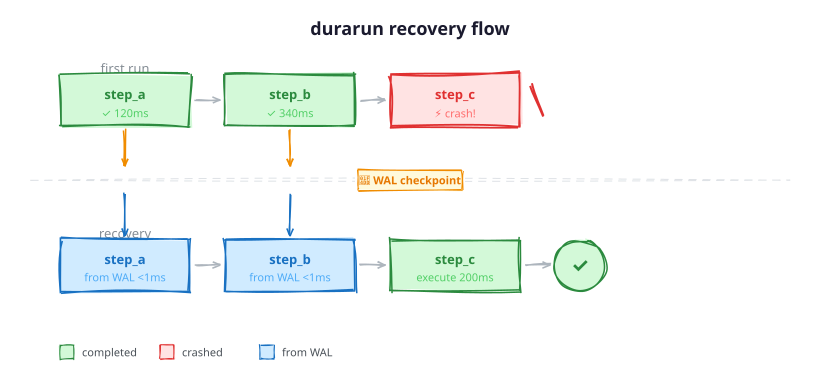

# durarun

**Durable execution for AI agent workflows. Just `pip install`, no containers, no server.**

[](https://pypi.org/project/durarun/)
[](https://pypi.org/project/durarun/)
[](LICENSE)
[](https://github.com/Chao-superw/durarun/actions)

durarun persists every step result to a Write-Ahead Log as your workflow runs. If the process crashes, call `run()` again: completed steps load from the WAL and execution resumes where it stopped.

<p align="center">
  
</p>

## Why durarun?

AI agent workflows call LLMs, tools, and APIs in multi-step sequences that can take minutes. A crash at step 9 of 10 means re-running everything, including all those API calls. durarun checkpoints each step result, so recovery skips what already succeeded.

| | durarun | Temporal | DBOS | Inngest |
|---|---|---|---|---|
| Install | `pip install` | Cluster + SDK | Cloud service | Cloud service |
| Infra needed | None (SQLite file) | Temporal server | Postgres + cloud | Event bus + cloud |
| Code change | `@step` decorator | Activity/Workflow classes | Decorator + config | Step functions |
| Async support | Native `arun()` | Via async activity | Limited | N/A (HTTP) |
| LangGraph integration | Built-in checkpointer | Manual | Manual | Manual |
| Best for | Python AI agents | Microservice orchestration | Transactional apps | Event-driven workflows |

## Quick start

```bash
pip install durarun
```

```python
from durarun import DurableRunner

runner = DurableRunner(backend="sqlite://./my_agent.db")

@runner.step
def fetch_data(ctx):
    return {"items": [1, 2, 3]}

@runner.step(retry=2, timeout="10s")
def process(ctx):
    data = ctx.get("fetch_data")
    return {"total": sum(data["items"])}

@runner.step
def save_result(ctx):
    result = ctx.get("process")
    return f"saved: {result['total']}"

result = runner.run([fetch_data, process, save_result])
print(result.steps)            # {'fetch_data': ..., 'process': ..., 'save_result': ...}
print(result.recovered_steps)  # 0 on first run; >0 after crash recovery
```

If this process crashes after `fetch_data` completes, running it again with the same database will skip `fetch_data` (loaded from WAL) and continue from `process`.

## Features

- Step results persist to a WAL on disk and survive process restarts.
- `@step` decorator with per-step `retry` and `timeout`, accepting readable durations like `"30s"` or `"2m"`.
- Two WAL backends included: `SqliteWAL` for production, `MemoryWAL` for tests. You can also implement `WALBackend` for your own.
- `arun()` for asyncio workflows.
- Optional OpenTelemetry tracing, lazy-loaded. If the SDK isn't installed, nothing happens.
- LangGraph `BaseCheckpointSaver` implementation included.
- Full type annotations with `py.typed` marker.

## Crash recovery

```python
# Resume the most recent incomplete run
runner = DurableRunner(backend="sqlite://./my_agent.db")
result = runner.resume(steps=[fetch_data, process, save_result])
```

Or pass a specific `run_id`:

```python
runner = DurableRunner(
    backend="sqlite://./my_agent.db",
    run_id="my-specific-run",
)
result = runner.run([fetch_data, process, save_result])
```

## Context

Steps receive a `Context` object. Use it to read earlier step results or pass custom data:

```python
@runner.step
def step_a(ctx):
    ctx.set_custom("my_key", 42)
    return "hello"

@runner.step
def step_b(ctx):
    prev = ctx.get("step_a")           # "hello"
    custom = ctx.get_custom("my_key")   # 42
    return f"{prev} world ({custom})"
```

## Observability

```python
# Stdout tracing (default, no extra dependencies)
runner = DurableRunner(backend="sqlite://./app.db")

# OTLP export (requires durarun[otel])
runner = DurableRunner(
    backend="sqlite://./app.db",
    otel_endpoint="http://localhost:4317",
)
```

After a run, inspect the timeline:

```python
result = runner.run(steps)
for event in result.timeline:
    print(event)  # {"step": "fetch_data", "duration_ms": 12.3, "source": "live", ...}
```

## WAL backends

| Backend | URI | Use case |
|---------|-----|----------|
| `SqliteWAL` | `sqlite://./path.db` | Production, durable and crash-safe |
| `MemoryWAL` | `memory://` | Tests, fast and ephemeral |

Custom backend:

```python
from durarun import WALBackend

class MyBackend:
    def append(self, run_id, step_name, result, metadata=None): ...
    def read(self, run_id) -> list[StepRecord]: ...
    def mark_complete(self, run_id): ...
    def list_incomplete(self) -> list[RunInfo]: ...
    def fsync(self): ...
```

## LangGraph integration

```python
from durarun.integrations.langgraph import DurarunCheckpointer

checkpointer = DurarunCheckpointer(db_path="./langgraph.db")
# Pass to your LangGraph graph as the checkpoint_saver
```

## Installation extras

```bash
pip install durarun[otel]        # OpenTelemetry tracing
pip install durarun[langgraph]   # LangGraph checkpointer
pip install durarun[all]         # everything
```

---

<details>
<summary><b>简体中文</b></summary>

## 简体中文

一个给 AI Agent 工作流加上持久化执行能力的 Python 库。`pip install` 即可使用，不需要容器或额外服务。

durarun 在工作流运行过程中，把每个 step 的结果写入 Write-Ahead Log (WAL)。如果进程中途崩溃，再次调用 `run()` 就行：已完成的 step 从 WAL 读取，执行从断点继续。

### 功能

- 每个 step 的结果都持久化到 WAL，进程崩溃后恢复时直接从磁盘回放，不重新执行。
- `@step` 装饰器支持逐步设置 `retry` 和 `timeout`，超时时间支持 `"30s"`、`"2m"` 这样的可读格式。
- 内置两种 WAL 后端：`SqliteWAL` 用于生产环境，`MemoryWAL` 用于测试。
- `arun()` 支持 asyncio 异步工作流。
- 可选的 OpenTelemetry 链路追踪，懒加载实现。不装 SDK 就不会有任何开销。
- 内置 LangGraph `BaseCheckpointSaver` 实现。
- 完整的类型注解，附带 `py.typed` 标记。

### 安装

```bash
pip install durarun
```

可选依赖：

```bash
pip install durarun[otel]        # OpenTelemetry 链路追踪
pip install durarun[langgraph]   # LangGraph checkpointer
pip install durarun[all]         # 全部
```

### 快速开始

```python
from durarun import DurableRunner

runner = DurableRunner(backend="sqlite://./my_agent.db")

@runner.step
def fetch_data(ctx):
    return {"items": [1, 2, 3]}

@runner.step(retry=2, timeout="10s")
def process(ctx):
    data = ctx.get("fetch_data")
    return {"total": sum(data["items"])}

@runner.step
def save_result(ctx):
    result = ctx.get("process")
    return f"saved: {result['total']}"

result = runner.run([fetch_data, process, save_result])
print(result.steps)            # {'fetch_data': ..., 'process': ..., 'save_result': ...}
print(result.recovered_steps)  # 首次运行为 0；崩溃恢复后 >0
```

假设进程在 `fetch_data` 完成后崩溃了，用同一个数据库再次运行会跳过 `fetch_data`（从 WAL 加载），从 `process` 继续。

### 崩溃恢复

```python
# 恢复最近一次未完成的 run
runner = DurableRunner(backend="sqlite://./my_agent.db")
result = runner.resume(steps=[fetch_data, process, save_result])
```

也可以指定 `run_id`：

```python
runner = DurableRunner(
    backend="sqlite://./my_agent.db",
    run_id="my-specific-run",
)
result = runner.run([fetch_data, process, save_result])
```

### 异步

```python
result = await runner.arun([fetch_data, process, save_result])
```

### Context

每个 step 的第一个参数是 `Context` 对象，用来读取之前 step 的结果或者在 step 之间传递自定义数据：

```python
@runner.step
def step_a(ctx):
    ctx.set_custom("my_key", 42)
    return "hello"

@runner.step
def step_b(ctx):
    prev = ctx.get("step_a")           # "hello"，step_a 的结果
    custom = ctx.get_custom("my_key")   # 42
    return f"{prev} world ({custom})"
```

### 可观测性

```python
# 标准输出追踪（默认，无额外依赖）
runner = DurableRunner(backend="sqlite://./app.db")

# OTLP 导出（需要 durarun[otel]）
runner = DurableRunner(
    backend="sqlite://./app.db",
    otel_endpoint="http://localhost:4317",
)
```

运行结束后可以查看时间线：

```python
result = runner.run(steps)
for event in result.timeline:
    print(event)  # {"step": "fetch_data", "duration_ms": 12.3, "source": "live", ...}
```

### WAL 后端

| 后端 | URI | 用途 |
|------|-----|------|
| `SqliteWAL` | `sqlite://./path.db` | 生产环境，持久化且崩溃安全 |
| `MemoryWAL` | `memory://` | 测试用，快速且无持久化 |

也可以自己实现 `WALBackend` 协议来写自定义后端：

```python
from durarun import WALBackend

class MyBackend:
    def append(self, run_id, step_name, result, metadata=None): ...
    def read(self, run_id) -> list[StepRecord]: ...
    def mark_complete(self, run_id): ...
    def list_incomplete(self) -> list[RunInfo]: ...
    def fsync(self): ...
```

### LangGraph 集成

```python
from durarun.integrations.langgraph import DurarunCheckpointer

checkpointer = DurarunCheckpointer(db_path="./langgraph.db")
# 作为 checkpoint_saver 传给你的 LangGraph graph
```

</details>

## License

[MIT](LICENSE)
